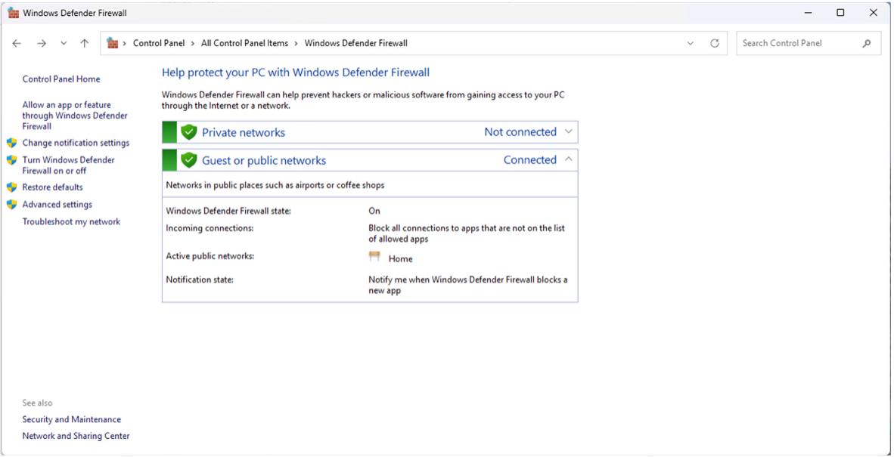
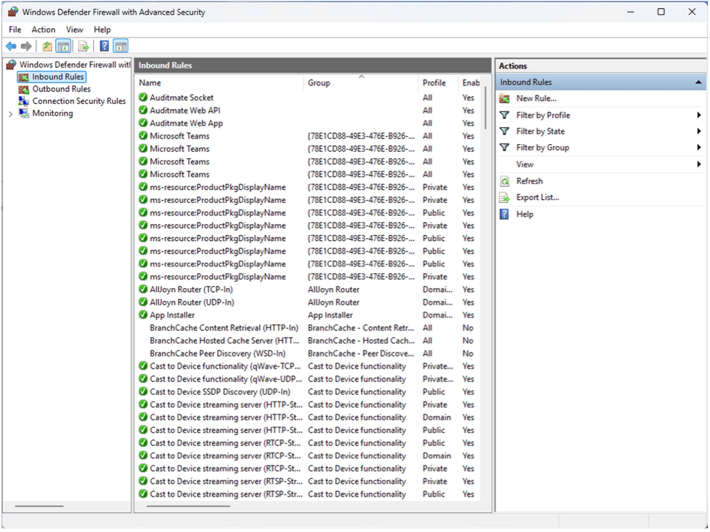

# Firewall Setup

Create inbound firewall rules to allow remote access to the **AuditMateMFG™** web application, API, and socket services.

---

## 1. Web Application Port

1. Open **Windows Defender Firewall**

2. Click **Advanced Settings → Inbound Rules → New Rule**

3. Select **Port → TCP**
4. Enter local port: `3080`
5. Select **Allow the connection**
6. Leave **Profile** settings at their defaults
7. Name the rule: `AuditMate Web App`
8. Click **Finish**

---

## 2. Web API Port

1. Repeat all steps from above using TCP port: `3081`
2. Name the rule: `AuditMate Web API`

---

## 3. Socket Port

1. Repeat all steps from above using TCP port: `3085`
2. Name the rule: `AuditMate Socket`

---

⚠️ **Note:** Ensure the firewall rules match the ports configured in Deployment Manager and IIS bindings.

---

## Next Steps

After firewall setup, proceed to [IIS Application Pool and Site Configuration](/docs/getting-started/installation/iis-application-pool-and-site-configuration).
