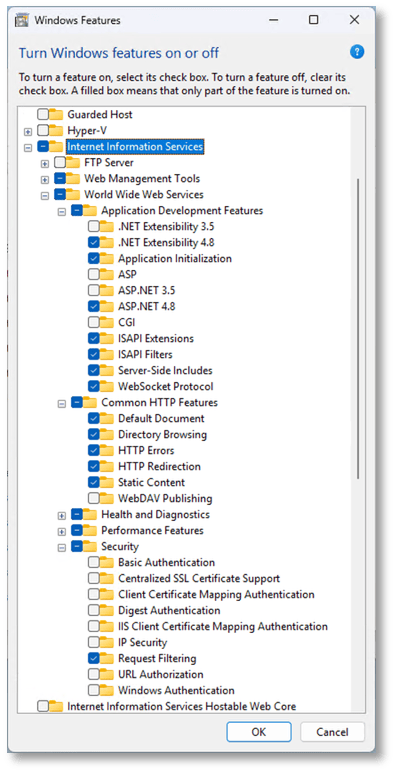
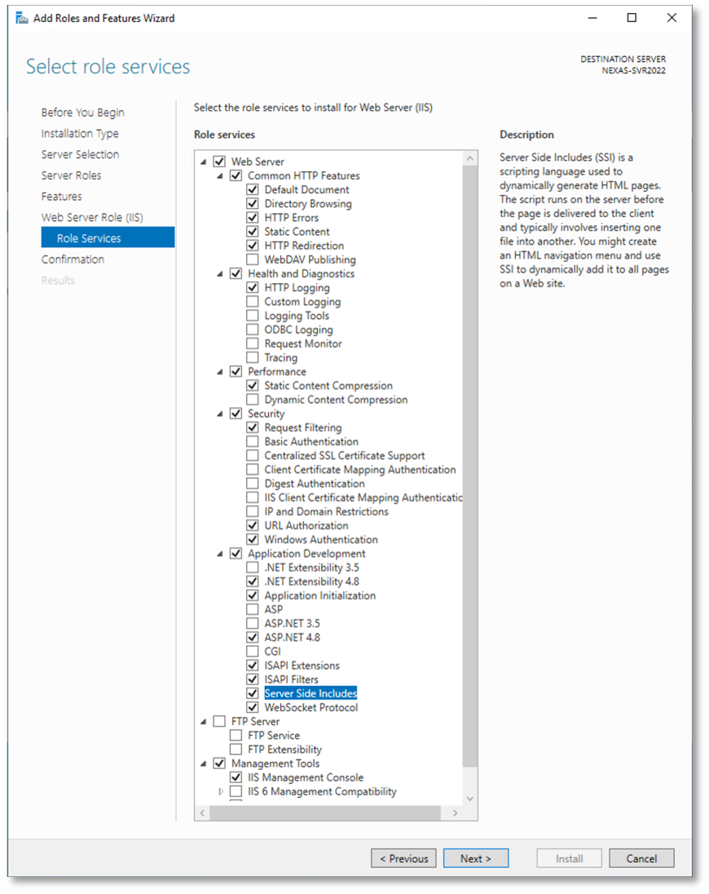

# IIS Setup

Internet Information Services (IIS) must be installed and configured before deploying **AuditMateMFG™ Revision Manager**.

Select the appropriate setup guide based on your hosting environment:

- [Windows 11 Setup](#windows-11-setup) if hosting on a Windows 11 machine
- [Windows Server Setup](#windows-server-setup) if hosting on Windows Server

---

## Windows 11 Setup

1. Open **Windows Features**
2. Enable **Internet Information Services**
3. Expand **World Wide Web Services > Application Development Features** and enable:
   - .NET Extensibility 4.8
   - Application Initialization
   - ASP.NET 4.8
   - ISAPI Extensions
   - ISAPI Filters
   - Server-Side Includes
   - WebSocket Protocol
4. Under **Common HTTP Features**, enable **HTTP Redirection**
5. Click **OK** and wait for installation to complete

---

## Windows Server Setup

1. Open **Server Manager** → **Add Roles and Features**
2. Proceed through the wizard until **Server Roles**
3. Select **Web Server (IIS)** → click **Add Features** if prompted
4. Continue to **Role Services**

5. Enable the following:

**Common HTTP Features**

- HTTP Redirection

**Security**

- URL Authorization
- Windows Authentication

**Application Development**

- .NET Extensibility 4.8
- Application Initialization
- ASP.NET 4.8
- ISAPI Extensions
- ISAPI Filters
- Server-Side Includes
- WebSocket Protocol

6. Click **Next** until Confirmation
7. Enable **Restart the destination server automatically if required**
8. Click **Install** and wait for completion

---

## Next Steps

After completing IIS setup:

1. Open a browser
2. Navigate to: http://localhost
3. Confirm that the IIS default page is displayed

Then proceed to [Application Deployment](/docs/getting-started/installation/application-deployment) to deploy the **AuditMateMFG™ system files**.
