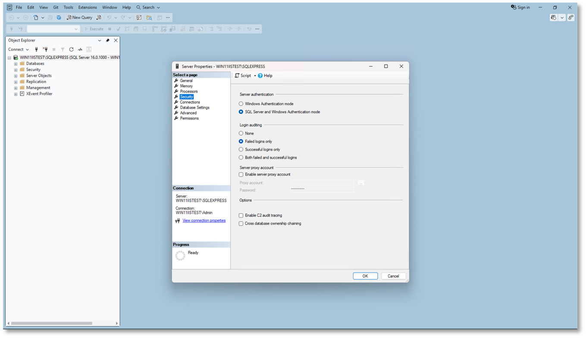

# Configure Authentication Mode

Enable Mixed Mode authentication to allow both Windows and SQL Server authentication.

## Steps

1. Open **SQL Server Management Studio (SSMS)**
2. Connect to your SQL Server instance
3. Right-click the server name → **Properties**
4. Select the **Security** page
5. Choose **SQL Server and Windows Authentication mode**
6. Click **OK**
7. Restart the SQL Server instance to apply the changes

⚠️ **Note:** Mixed Mode authentication is required for the application to connect using a SQL Server login.

## Next Step

After enabling Mixed Mode authentication, proceed to [Create SQL Server Login](/docs/getting-started/installation/sql-server-configuration/create-sql-login) to set up the required database access for the application.
