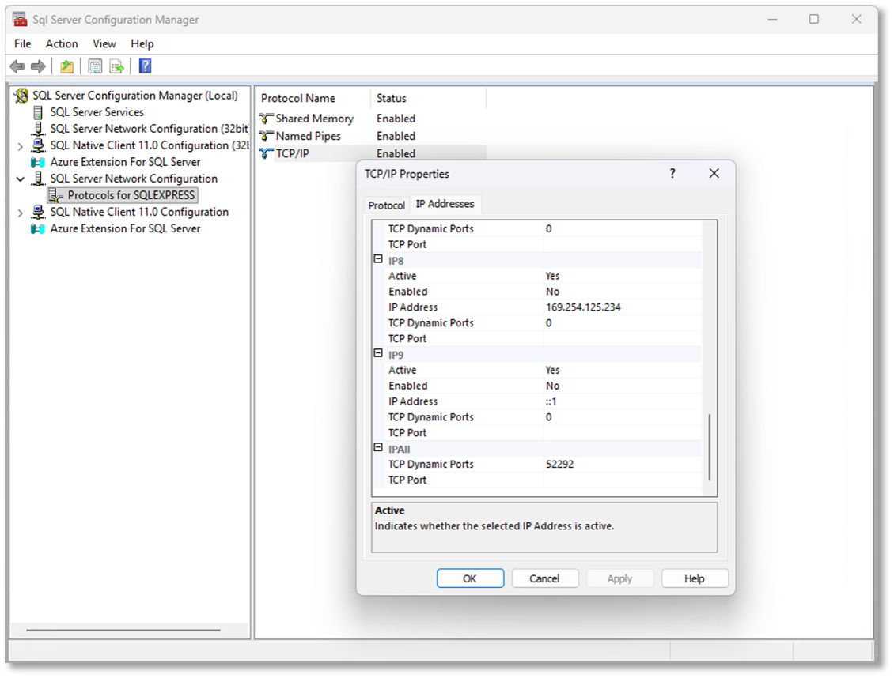

# Enable Network Protocols in SQL Server

Enable the required network protocols to allow connections to the SQL Server instance.

## Steps

1. Open **SQL Server Configuration Manager**
2. Navigate to: **SQL Server Network Configuration > Protocols for [Your Instance]**
3. Enable the following protocols:
   - **Shared Memory**
   - **Named Pipes**
   - **TCP/IP**
4. Go to **SQL Server Services**
5. Right-click the SQL Server instance → **Restart**
6. Return to: **SQL Server Network Configuration > Protocols for [Your Instance]**
7. Right-click **TCP/IP** → **Properties**
8. Go to the **IP Addresses** tab
9. Note the port number under **IPAll → TCP Dynamic Ports** (or assign a static port if required)

⚠️ **Note:** Take note of the port number set in the TCP Dynamic Ports as this will be required during application deployment when configuring the database connection.

## Next Step

After enabling network protocols, proceed to [Configure Authentication Mode](/docs/getting-started/installation/sql-server-configuration/configure-authentication-mode) to continue the SQL Server setup.
