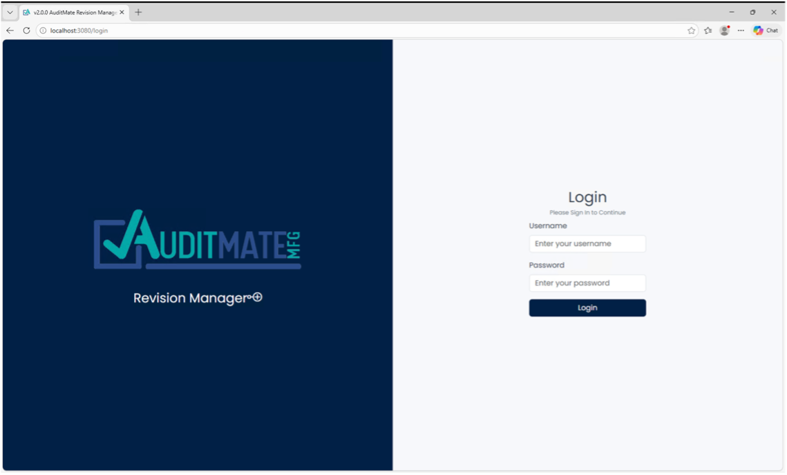

# Verification

Confirm that **AuditMateMFG™ Revision Manager** is installed and running correctly by accessing the application and logging in with the default credentials.

---

## Steps

1. Open a web browser and navigate to your application URL

   Example: `http://[your-server-name]:3080/login`

2. Log in using the default credentials:

| Field        | Value            |
| ------------ | ---------------- |
| **Username** | `AuditmateAdmin` |
| **Password** | `Testingpw24#`   |

3. Confirm that the application dashboard loads successfully and that all core features are accessible

⚠️ **Note:** Change the default administrator password immediately after your first login.

---

## Next Steps

With installation verified, proceed to the [Main Screen Overview](/docs/getting-started/main-screen-overview) to familiarize yourself with the application interface.
