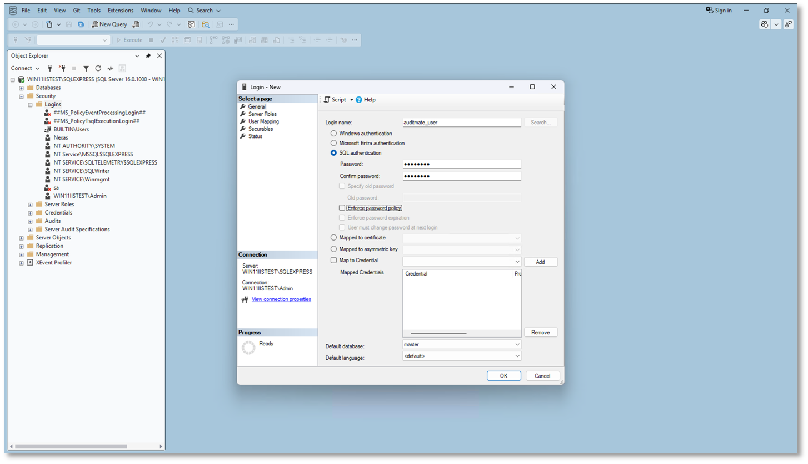
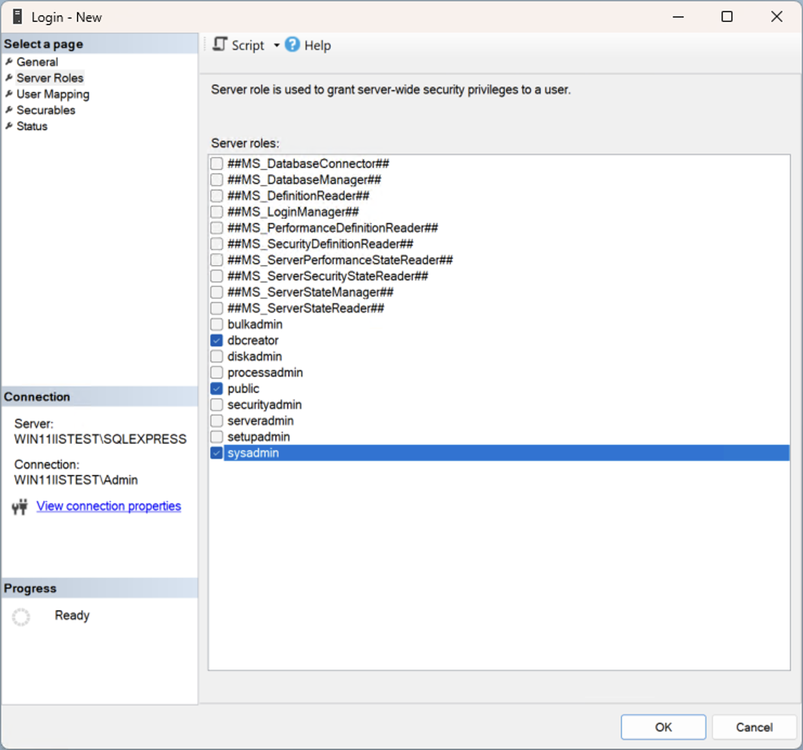

# Create SQL Server Login

Create a dedicated SQL Server login for **AuditMateMFG™ Revision Manager** to allow database access and configuration during installation.

## Steps

1. Open **SQL Server Management Studio (SSMS)**
2. Connect to your SQL Server instance
3. Expand **Security > Logins**
4. Right-click **Logins** → Select **New Login**
5. Configure Login Details:
   - **Login name:** `auditmate_user`
   - **Authentication:** SQL Server Authentication
   - **Password:** Set a secure password
6. Uncheck **Enforce password policy**
7. Assign **Server Roles**
8. Assign the following roles:
   - `dbcreator`
   - `sysadmin`

⚠️ **Note:** Make sure to note your Server Name and SQL Server login credentials -- you will need them during application deployment.

---

## Next Steps

After creating the SQL Server login, proceed to [IIS Setup](/docs/getting-started/installation/iis-setup) to continue the installation process.
